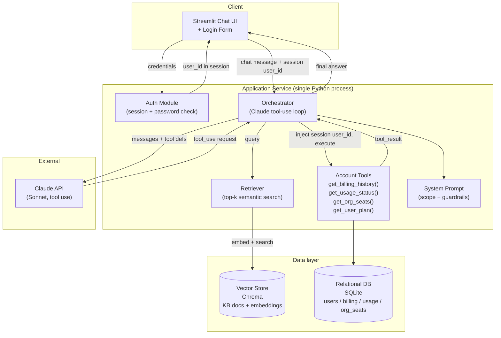
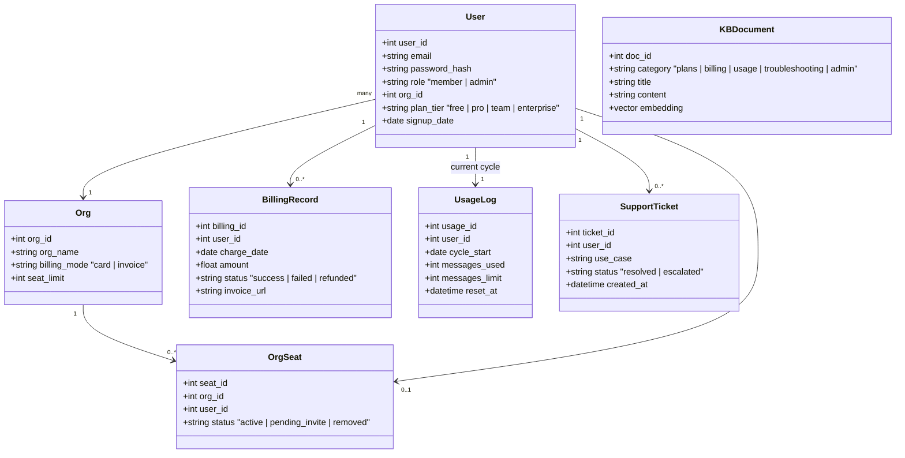
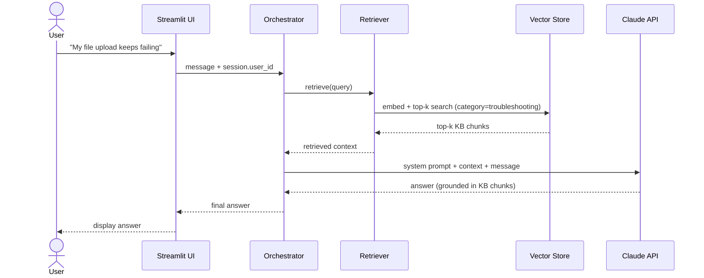
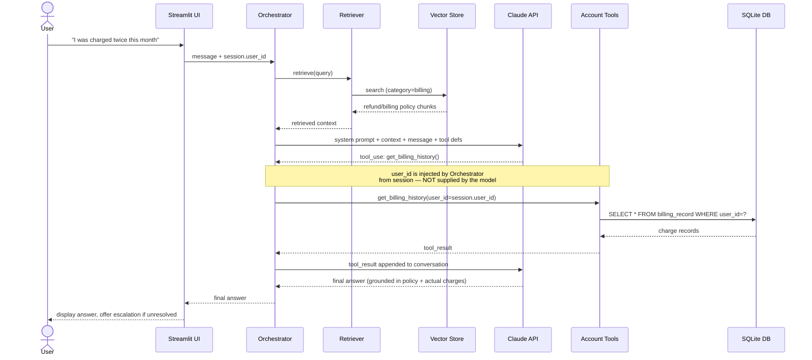
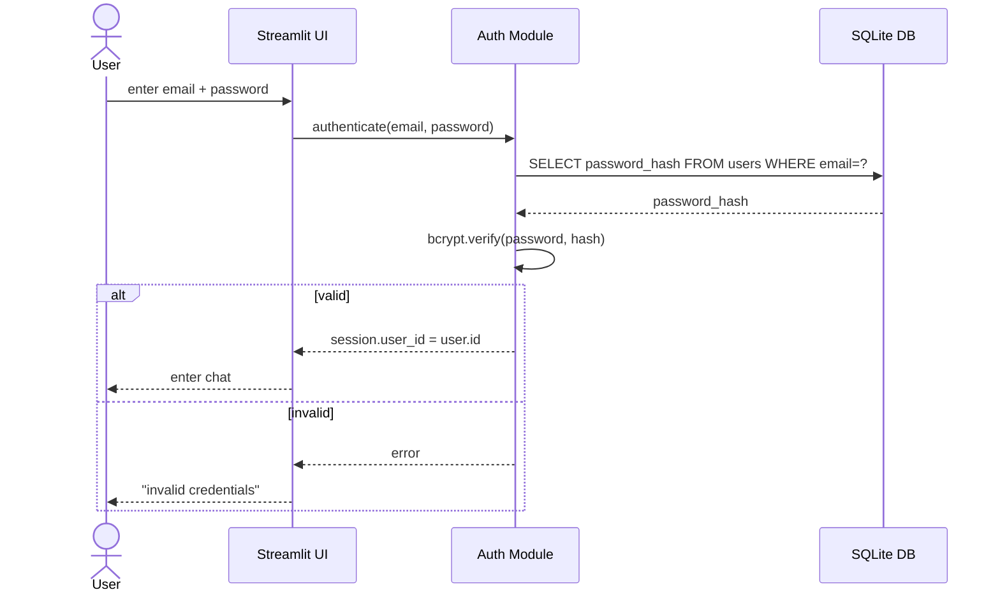
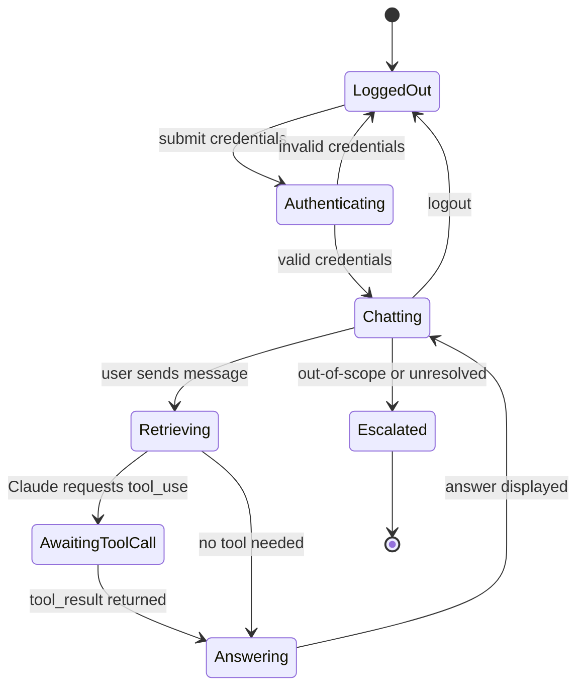

# Helpdesk RAG Bot — MVP Architecture

Status: Planning draft for 2-week MVP
Scope: 5 use cases (plan guidance, billing, usage limits, feature troubleshooting, org/seat management), authenticated per-user access.

---

## 1. Design principles

1. **RAG for static knowledge, tool-calls for account data.** Plans/policies/troubleshooting docs live in a vector store. Anything about *this* user (billing, usage, seats) is fetched live from a database via a tool call — never embedded, never stale.
2. **Identity is enforced server-side, not by the model.** Tool functions never accept a `user_id` argument from the LLM. The orchestration layer injects the authenticated session's user ID directly into every tool call. The model cannot request another user's data because it never has the ability to name a user.
3. **Small, boring stack.** No agent framework, no microservices. One Python process, two data stores (vector + relational), a single orchestration loop. Complexity is deferred past the MVP.
4. **Scoped and escorted.** The system prompt restricts the bot to the 5 use cases; anything else triggers a "hand off to human agent" fallback rather than an improvised answer.

---

## 2. Component diagram



**Why this shape:** the Orchestrator is the only component that ever sees both the Claude API and the authenticated `user_id`. The LLM only ever sees tool *results*, never raw database access or other users' identifiers — that boundary is what makes per-user isolation actually enforceable instead of just prompted-for.

---

## 3. Data model (class / ER diagram)



`KBDocument` is the only table that feeds the vector store; everything else is queried live via tool calls, never embedded.

---

## 4. Sequence: pure-RAG query (Use Case 4 — feature troubleshooting)

No account data needed — this is the baseline case.



---

## 5. Sequence: RAG + account tool-call (Use Case 2 — billing issue)

Account-specific — requires a bound tool call.



---

## 6. Sequence: login / session



---

## 7. Conversation/session state



---

## 8. Repository layout (proposed)

```
rag-impl/
├── app.py                  # Streamlit entrypoint (login gate + chat UI)
├── auth.py                 # session handling, password check
├── orchestrator.py         # Claude tool-use loop, binds user_id server-side
├── retriever.py            # embedding + Chroma top-k search
├── tools/
│   ├── billing.py          # get_billing_history
│   ├── usage.py            # get_usage_status
│   ├── org.py              # get_org_seats
│   └── plan.py             # get_user_plan
├── data/
│   ├── seed_kb.py          # generates + embeds KB docs into Chroma
│   ├── seed_accounts.py    # Faker-generated users/billing/usage/org data -> SQLite
│   └── kb_docs/            # markdown source docs, one per KB article
├── prompts/
│   └── system_prompt.md    # scope + guardrails
├── eval/
│   └── golden_set.jsonl    # ~30-50 labeled test queries across 5 use cases
└── docs/
    └── ARCHITECTURE.md     # this file
```

---

## 9. Tech stack summary

| Layer | Choice | Why |
|---|---|---|
| LLM | Claude (Sonnet) via Anthropic API, native tool use | Skips agent-framework overhead for 5 well-defined use cases |
| Vector store | Chroma (embedded/local) | Zero infra, fast to stand up in a 2-week window |
| Embeddings | Voyage or local `sentence-transformers` | Either is adequate at this corpus size |
| Relational DB | SQLite | Single-file, no server to run, fine for MVP concurrency |
| Frontend | Streamlit | Login form + chat in one framework, fastest path to a demo |
| Orchestration | Plain Python, no LangChain/LlamaIndex | 5 tools + 1 retrieval step doesn't need a framework |
| Auth | Session-based, bcrypt-hashed passwords, seeded users | Real per-user isolation without building SSO |

---

## 10. Security note (do not skip)

The single most important invariant in this system: **tool functions take zero identity parameters from the model.** Every tool signature the orchestrator exposes to Claude should look like `get_billing_history() -> list[Charge]`, not `get_billing_history(user_id: int)`. The Orchestrator wraps each tool at call time with the session's `user_id` before execution. This makes cross-user data leakage structurally impossible rather than dependent on the model refusing a bad prompt.
